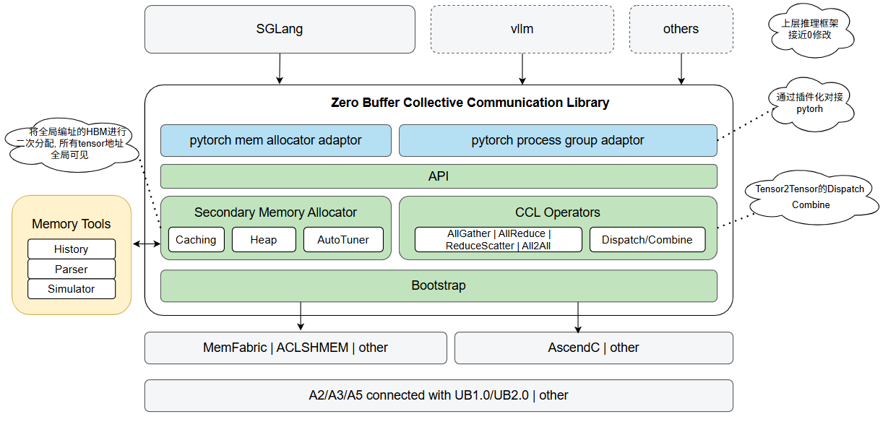

# ZBCCL

## 🔄Latest News

## 🎉Introduction

ZBCCL stands for Zero Buffer Collective Communication Library. It is designed for LLM inference on Ascend NPU, there is two key advantages: <b>zero intermediate buffer</b> and <b>blazing fast</b>.

## 🧩Core Features
Two major features:

* Secondary memory allocator
* Bunch of key collective functions

## 🔥Performance

## 🔍Code structure

## 🚀Quickstart

## 📑Api reference

## 📦Pre-request hardware and software
- Hardware
  - Device:
  - Host: aarch64/x86

- Software:
  - CANN 8.1.RC1 and later
  - cmake >= 3.19
  - GLIBC >= 2.28

## 📝 Other information

- [Security Note](./doc/SECURITYNOTE.md)

- [License](./LICENSE)
